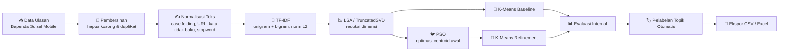

<div align="center">

# 🧠 Rekayasa Komputasional

### Pelabelan Otomatis Topik Review Aplikasi *Bapenda Sulsel Mobile*
### Menggunakan Klastering **K-Means** yang Dioptimasi dengan **Particle Swarm Optimization (PSO)**

<br/>


-lightgrey?style=flat-square)

</div>

---

## 👥 Anggota

<div align="center">

| No | Nama | NIM |
|:--:|:--|:--|
| 1 | Muh. As'ad Habib | `105841118224` |
| 2 | Andi Akbar Arya Putra | `105841117924` |
| 3 | Muhammad Rafly Aprial Ridho | `105841120324` |

</div>

---

## 📌 Ringkasan Proyek

> Ulasan pengguna di Play Store jumlahnya banyak dan tidak berlabel. Membacanya satu per satu tidak efisien.
> Proyek ini **melabeli topik ulasan secara otomatis** dengan mengelompokkan (klastering) ulasan aplikasi
> **Bapenda Sulsel Mobile**, lalu memberi nama topik dari kata kunci dominan tiap klaster.

Masalah klasik K-Means adalah **inisialisasi centroid yang acak**, sehingga hasilnya mudah terjebak pada
optimum lokal dan berubah-ubah tiap dijalankan. Di sini, **Particle Swarm Optimization (PSO)** dipakai untuk
mencari posisi centroid awal yang lebih baik sebelum disempurnakan oleh K-Means (*memetic PSO–K-Means*).

<table>
<tr>
<td width="33%" align="center">

### 🎯 Tujuan
Melabeli topik ulasan secara otomatis tanpa anotasi manual

</td>
<td width="33%" align="center">

### ⚙️ Metode
TF-IDF → LSA → PSO → K-Means

</td>
<td width="33%" align="center">

### 📈 Hasil
Klaster lebih rapat & lebih stabil dibanding baseline

</td>
</tr>
</table>

---

## 🔄 Alur Kerja



<details>
<summary><b>🔍 Klik untuk melihat detail tiap tahap</b></summary>

<br/>

| # | Tahap | Penjelasan Singkat |
|:--:|:--|:--|
| 1 | **Persiapan** | Impor library, tetapkan `RANDOM_STATE = 42` agar hasil dapat direproduksi |
| 2 | **Pemuatan Data** | Membaca data ulasan bersih dan data mentah dari lokasi yang tersedia |
| 3 | **Validasi** | Menghapus baris kosong dan duplikat, lalu menampilkan ringkasan data |
| 4 | **Representasi Teks** | Normalisasi teks → **TF-IDF** (unigram + bigram, L2) → **LSA (TruncatedSVD)** |
| 5 | **Pemilihan K** | Menguji beberapa nilai K dengan metrik internal untuk memilih jumlah klaster |
| 6 | **Baseline** | K-Means dengan inisialisasi acak sebagai pembanding |
| 7 | **PSO** | Setiap partikel merepresentasikan satu set centroid; fitness = SSE |
| 8 | **PSO–K-Means** | Centroid terbaik dari PSO disempurnakan K-Means, dibandingkan pada seed yang sama |
| 9 | **Perbandingan** | Rata-rata & simpangan baku metrik dari 10 pengulangan |
| 10 | **Pelabelan** | Nomor klaster diubah menjadi label topik dari kata kunci TF-IDF dominan |
| 11 | **Visualisasi** | Sebaran klaster pada 2 komponen LSA pertama + ukuran tiap topik |
| 12 | **Ekspor** | Menyimpan hasil pelabelan, metrik, dan riwayat optimasi |
| 13 | **Kesimpulan** | Ringkasan kuantitatif perbandingan baseline vs PSO–K-Means |

</details>

---

## 🧬 Parameter PSO

<div align="center">

| Parameter | Simbol | Nilai | Keterangan |
|:--|:--:|:--:|:--|
| Jumlah partikel | `n` | **30** | Ukuran swarm |
| Jumlah iterasi | `T` | **40** | Batas iterasi optimasi |
| Bobot inersia | `w` | **0.72** | Menjaga momentum partikel |
| Koefisien kognitif | `c1` | **1.49** | Tarikan ke *personal best* |
| Koefisien sosial | `c2` | **1.49** | Tarikan ke *global best* |
| Fungsi fitness | `f` | **SSE** | Semakin kecil semakin baik |

</div>

---

## 📊 Hasil Evaluasi

Rata-rata **10 pengulangan** pada **K = 3**:

<div align="center">

| Metrik | K-Means Baseline | PSO–K-Means | Arah Baik | Status |
|:--|:--:|:--:|:--:|:--:|
| **Silhouette** | 0.111130 | **0.117294** | ⬆️ makin besar | ✅ naik `+0.0062` |
| **Davies–Bouldin** | 3.593311 | **3.439903** | ⬇️ makin kecil | ✅ turun `-0.1534` |
| **Calinski–Harabasz** | 21.996697 | **23.342082** | ⬆️ makin besar | ✅ naik `+1.3454` |
| **Inertia (SSE)** | 296.582599 | **294.674659** | ⬇️ makin kecil | ✅ turun `-1.9079` (0.643%) |
| **Waktu (detik)** | **0.0384** | 0.6286 | ⬇️ makin kecil | ⚠️ lebih lambat |

</div>

<details>
<summary><b>📐 Kestabilan antar-seed (simpangan baku 10 pengulangan)</b></summary>

<br/>

| Metrik | K-Means Baseline | PSO–K-Means | Interpretasi |
|:--|:--:|:--:|:--|
| Silhouette | 0.014571 | **0.006145** | PSO–K-Means jauh lebih konsisten |
| Davies–Bouldin | **0.138280** | 0.148423 | Relatif setara |
| Calinski–Harabasz | 1.360444 | **0.242667** | Variasi jauh lebih kecil |
| Inertia (SSE) | 1.940882 | **0.340263** | Hasil sangat stabil tiap dijalankan |

**Kesimpulan:** PSO–K-Means memberi kualitas klaster yang sedikit lebih baik dan **jauh lebih stabil**,
dengan konsekuensi waktu komputasi yang lebih lama.

</details>

---

## 🏷️ Topik yang Terbentuk

<div align="center">

| Klaster | 🏷️ Label Topik | Kata Kunci Dominan | Jumlah | Porsi |
|:--:|:--|:--|:--:|:--|
| `2` | **Pengalaman dan kinerja aplikasi** | membantu, cek, error, mantap | **171** | `████████████░░░░░░░░` 45.4% |
| `0` | **Pembayaran dan layanan Samsat** | samsat, bayar, pajak, bayar pajak | **139** | `█████████░░░░░░░░░░░` 36.9% |
| `1` | **Informasi dan pengecekan pajak kendaraan** | kendaraan, pajak kendaraan, pajak, membantu | **67** | `████░░░░░░░░░░░░░░░░` 17.8% |
| | | **Total** | **377** | `100%` |

</div>

---

## 📁 Struktur Repositori

```
klasterisasi-review-aplikasi-bapenda-sulsel-mobile/
├── 📓 Klastering_Topik_Ulasan_Bapenda_Sulsel_Mobile_KMeans_PSO.ipynb
├── 📗 seluruh_review_Bapenda_Sulsel_Mobile.xlsx
├── 📗 dataset_review_clean_final.xlsx
├── 📄 hasil_pelabelan_topik_pso_kmeans.csv
├── 📗 hasil_pelabelan_topik_pso_kmeans.xlsx
└── 📘 README.md
```

<div align="center">

| Berkas | Peran | Keterangan |
|:--|:--:|:--|
| `Klastering_Topik_Ulasan_..._KMeans_PSO.ipynb` | 🧪 Utama | 13 blok: preprocessing, TF-IDF, LSA, K-Means, PSO, evaluasi, pelabelan, visualisasi, ekspor |
| `seluruh_review_Bapenda_Sulsel_Mobile.xlsx` | 📥 Input | Data mentah ulasan (sheet `Review`) |
| `dataset_review_clean_final.xlsx` | 📥 Input | Ulasan hasil pembersihan (sheet `Sheet1`, kolom `review_clean_final`) |
| `hasil_pelabelan_topik_pso_kmeans.csv` / `.xlsx` | 📤 Output | Hasil akhir pelabelan topik per ulasan |

</div>

<details>
<summary><b>🗂️ Struktur kolom berkas hasil</b></summary>

<br/>

| Kolom | Tipe | Deskripsi |
|:--|:--:|:--|
| `review_clean_final` | `str` | Teks ulasan setelah dibersihkan dan dinormalisasi |
| `cluster_baseline` | `int` | Nomor klaster hasil K-Means baseline |
| `cluster_pso_kmeans` | `int` | Nomor klaster hasil PSO–K-Means |
| `label_otomatis` | `str` | Kata kunci TF-IDF dominan pada klaster tersebut |
| `label_topik` | `str` | Nama topik akhir yang mudah dibaca |

Contoh baris:

```csv
review_clean_final,cluster_baseline,cluster_pso_kmeans,label_otomatis,label_topik
mantap aplikasi nya sangat membantu,1,2,membantu / cek / error / mantap,Pengalaman dan kinerja aplikasi
memudahkan bagi masyarakat pengguna pajak kendaraan bermotor,0,1,kendaraan / pajak kendaraan / pajak / membantu,Informasi dan pengecekan pajak kendaraan
```

</details>

---

## 🚀 Cara Menjalankan

### 1️⃣ Instal dependensi

```bash
pip install numpy pandas matplotlib scikit-learn openpyxl jupyter
```

### 2️⃣ Jalankan notebook

```bash
jupyter notebook Klastering_Topik_Ulasan_Bapenda_Sulsel_Mobile_KMeans_PSO.ipynb
```

### 3️⃣ Eksekusi seluruh sel

Jalankan **berurutan dari atas ke bawah** (`Run All`). Pastikan berkas dataset berada pada folder yang sama
dengan notebook.

<details>
<summary><b>☁️ Menjalankan di Google Colab</b></summary>

<br/>

1. Buka [Google Colab](https://colab.research.google.com/) → **Upload notebook**.
2. Unggah juga berkas `seluruh_review_Bapenda_Sulsel_Mobile.xlsx` dan `dataset_review_clean_final.xlsx`
   ke panel **Files**.
3. Jalankan sel pertama — notebook sudah menyertakan penanganan instalasi library untuk lingkungan Colab.
4. Notebook mencari berkas dataset secara otomatis melalui fungsi `temukan_file()`.

</details>

<details>
<summary><b>🛠️ Troubleshooting</b></summary>

<br/>

| Gejala | Penyebab Umum | Solusi |
|:--|:--|:--|
| `FileNotFoundError` | Dataset tidak satu folder dengan notebook | Letakkan `.xlsx` di folder yang sama, atau perbarui path pada BLOK 2 |
| `ModuleNotFoundError: openpyxl` | Pembaca Excel belum terpasang | `pip install openpyxl` |
| Hasil metrik sedikit berbeda | Versi library berbeda | Wajar; tren perbandingan tetap konsisten |
| Proses PSO terasa lambat | 30 partikel × 40 iterasi × 10 seed | Kurangi jumlah seed atau iterasi pada BLOK 8 |

</details>

---

## 🔁 Reproduksibilitas

<table>
<tr>
<td width="50%">

**🎲 Seed tetap**
`RANDOM_STATE = 42` dipakai pada seluruh proses acak.

</td>
<td width="50%">

**🔂 Pengulangan**
Eksperimen diulang pada **10 seed** (`0–9`) untuk memastikan hasil stabil.

</td>
</tr>
<tr>
<td width="50%">

**⚖️ Perbandingan adil**
Baseline dan PSO–K-Means dievaluasi pada **seed yang sama**.

</td>
<td width="50%">

**📏 Metrik internal**
Silhouette, Davies–Bouldin, Calinski–Harabasz, dan SSE.

</td>
</tr>
</table>

---

<div align="center">

### 📚 Referensi Metode

`K-Means` · `Particle Swarm Optimization` · `TF-IDF` · `Latent Semantic Analysis` · `Memetic Algorithm`

<br/>

**Rekayasa Komputasional — Kelas 4-F**

<sub>Dibuat untuk keperluan tugas akademik.</sub>

</div>
